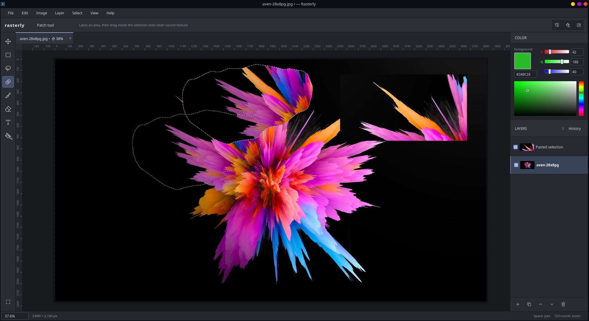

# Rasterly

A lightweight native raster image editor with a Photoshop-inspired dark workspace, designed around a focused set of everyday image-editing tools. Built with Python, Qt, Pillow, and NumPy; image processing runs locally.



Rasterly supports layered PNG, JPEG, and WebP workflows, freeform and rectangular selections, healing, transforms, and a per-document history. It is designed to stay lightweight and focused rather than recreate a full professional editing suite.

## Linux downloads

Download the installers from [GitHub Releases](https://github.com/tefaz/rasterly-image-editing-software/releases/latest):

- **AppImage:** portable x86_64 Linux build. Includes Python, Qt, Pillow, and NumPy.
- **Debian installer:** amd64 `.deb` for Ubuntu 22.04+, Debian 12+, and compatible distributions. Adds Rasterly to the applications menu and installs the `rasterly` command.

```sh
chmod +x Rasterly-0.1.0-x86_64.AppImage
./Rasterly-0.1.0-x86_64.AppImage
# Or, on Debian/Ubuntu:
sudo apt install ./rasterly_0.1.0_amd64.deb
```

The AppImage is suitable for CachyOS and other recent Linux distributions. Both packages require x86_64 and glibc 2.35 or newer. If FUSE is unavailable, run the AppImage with `--appimage-extract-and-run`. The release also includes `SHA256SUMS`, a source archive, and a build manifest containing dependency versions and source links. These builds use the local NumPy healing engine.

## Run from source

With a virtual environment already installed:

```sh
./run.sh
./run.sh /path/to/photo.png
```

For a fresh installation, use Python 3.11 or newer:

```sh
python3 -m venv .venv
.venv/bin/python -m pip install -e .
./run.sh
```

Rasterly starts with an empty workspace; use **New** or **Open** to create a document tab. You can also launch directly into an image with `./run.sh /path/to/photo.png`. `Rasterly.desktop` is a Linux launcher for this workspace. Update its `Exec` and `Icon` paths if you move the project. Installing through pip also provides the `rasterly` command. Qt supports Linux, Windows, and macOS; the current UI uses Ctrl shortcuts on all three.

## Editing

- **New / Open:** Create custom pixel dimensions or choose HD, QHD, 4K, and square presets. New images have one selected, visible, white background layer. PNG, JPEG, and WebP open at their stored pixel dimensions without resampling. Drop a single supported image or project into the window to open it.
- **Selections:** Rectangle and lasso tools show live pixel dimensions during dragging. Completed selections have animated dashed outlines. A lasso closes on release. Hold **Shift** before dragging to add an area to the current selection, or **left Alt** to subtract an area. You can mix rectangle and lasso regions, select separate islands, and cut holes in the selection. The combined outline previews while dragging; the dimension label measures the area being drawn. Dragging without a modifier replaces the selection. Escape cancels an unfinished selection and restores the previous selection. Fill, copy, move, transform, and patch respect the combined mask; crop uses the remaining selection's bounding box.
- **Move:** Drag the active layer. With a selection, only its active-layer pixels move, leaving transparency behind. Pixels moved outside the canvas are retained in the layer.
- **Crop:** Crop every layer to the selection's rectangular bounding box. Irregular selections crop to their complete axis-aligned bounds.
- **Free Transform:** Resize the selected pixels or active layer with eight handles. Dimensions can change independently; hold Shift to preserve the original ratio, including after rotation. Drag inside the box to reposition it. Right-click for horizontal and vertical flipping or **Rotate 90° Clockwise / Counterclockwise**. Rotation keeps the preview centered and swaps its width and height. Rotations and flips can be combined in any order. Enter / Apply commits; Escape / Cancel restores the source. Quarter turns transpose the original pixels losslessly; final resizing uses Lanczos resampling.
- **Fill:** Shift+F5 opens a dialog defaulting to Content-Aware. Solid Color uses a color picker and respects the complete irregular mask.
- **Patch:** Draw a freeform selection with the Patch Tool, then drag inside it onto clean material on the active layer. While drawing, only the traced outline appears; the line back to the starting point is hidden until release closes the selection. Rectangle, lasso, and patch selection drags may start in the workspace outside the image: selection begins where the drag enters the image frame. Releasing without entering leaves the current selection and history unchanged. The original location previews the source while dragging; release commits a healed patch. The green outline marks the source region. Hovering inside an existing selection changes the cursor to an outlined patch icon, indicating that dragging will position source material. Outside the selection, the crosshair indicates that dragging draws a new outline.
- **Image / Canvas Size:** Image Size resamples every layer. Canvas Size changes the document extent and positions unchanged layer pixels using a nine-position anchor. The default is Center. Both support pixels or percentages; Image Size has an optional aspect lock. Extra canvas space is transparent. Shrinking the canvas retains outlying layer pixels until a crop removes them.
- **Layers:** Create, delete, duplicate, rename, select, reorder, and toggle visibility. Top rows are the topmost layers. Drag rows to reorder, use the arrow buttons, or use the Layer menu. Double-click a name to rename. The visibility checkbox controls whether a layer contributes to the image. Hold **Ctrl** while clicking rows to add or remove layers from the selection. The active layer is shown in bold and remains the target of individual editing tools. Multiple selected layers are highlighted together and retained when switching tabs or saving a project. At least one layer remains in the document.
- **History:** Pixel edits, geometry changes, layer changes, and each committed selection change have named history entries. The attached History panel can restore earlier states. Ctrl+Z toggles between the current and previous entry; Ctrl+Alt+Z steps backward and Ctrl+Shift+Z steps forward. History is session state and is not saved into `.rasterly` projects.

## Document tabs, history, and copying

With at least two layers selected, right-click a selected row and choose **Merge Layers**, use **Layer → Merge Layers**, or press **Ctrl+E**. The selected layers are composited in their existing order into one selected layer at the highest selected layer's position. The merged layer keeps the active layer's name, transparency, offsets, and complete pixel extents, including pixels outside the canvas. Unselected layers keep their order. Selected hidden layers do not contribute to a visible merge; an entirely hidden group is merged internally and remains hidden. A merge is a single history action, and undo restores the original layers and their multiple selection.

Rasterly starts with an empty workspace and no image tabs. Use New or Open to create the first tab; launching with an image filename opens that file directly. New and Open add document tabs. Each tab keeps its own layers, selection, undo/redo timeline, file path, saved state, zoom, pan, and active tool. Click a tab to switch images. Switching cancels unfinished mouse previews and transforms without changing pixels.

Each tab has an **×** close button; **Ctrl+W** closes the active tab. Modified documents offer **Save**, **Discard**, and **Cancel** before closing. Canceling Save As or a failed save leaves the tab open. Closing an inactive tab saves that tab's image and then restores the active tab. Quitting checks every modified tab. Closing the last tab leaves an empty editor workspace where New and Open remain available.

The **History** button in the Layers panel header opens a window attached to the right side of the editor. It can also be shown through **View → History**. The list follows the active tab and highlights the current state. Click an earlier row to restore the entire document to that point, including layers, pixels, canvas dimensions, and the selection. Each completed rectangle, lasso, or patch selection, Shift addition, and Alt subtraction gets a named history entry. Select All and Deselect are also recorded. Ctrl+Z toggles between the current state and its previous history entry. Ctrl+Alt+Z steps backward repeatedly, and Ctrl+Shift+Z steps forward. Editing or navigating history resets the toggle pair; canceling an unfinished drag adds no entry. Selection changes share existing pixel buffers and do not mark a saved image as modified. Later states remain listed in gray and can be clicked to move forward again. Making another edit or selection change replaces those later states. The first row is the initial document, or the earliest retained state if the memory limit has pruned older commands.

**Ctrl+C** copies the current selection from the active layer at full resolution, retaining transparency and the exact lasso boundary. Copying leaves the original pixels untouched. **Ctrl+V** always inserts those pixels onto a new selected layer immediately above the active layer, clears the destination selection, and adds a Paste selection history command. Repeated pastes create separate layers. In the same document, paste retains the copied position; in a different document, it centers the pixels on the canvas without resampling. The clipboard survives switching or closing the source tab, and standard image clipboard content can also be pasted.

## Save and export

`.rasterly` projects are versioned ZIP archives containing a JSON manifest and lossless PNG layer images. They preserve canvas dimensions, complete layer pixels and transparency, positions, names, visibility, stacking order, and the active layer. Selections and undo history are session state.

**Save** writes to the current path; **Save As** chooses a new path. A new document defaults to `.rasterly`. If a raster document gains multiple layers, Save offers Save As with the project format selected. Explicitly saving several layers to a raster format asks before writing the visible flattened composite. The editable layers remain in the current session, but only `.rasterly` preserves them on reopen.

**Export Image** flattens visible layers to PNG, JPEG, or WebP without changing the document's project path or saved state. PNG and lossless WebP preserve transparency; JPEG uses a white background and quality 95. Writes use a temporary file and atomic replacement so a failed encoding leaves the existing file intact.

## Shortcuts

| Action | Shortcut |
| --- | --- |
| Move / Rectangle / Lasso / Patch | V / M / L / J |
| Add / Subtract selection area (Rectangle or Lasso) | Hold Shift / left Alt before dragging |
| New / Open / Save | Ctrl+N / Ctrl+O / Ctrl+S |
| Save As / Export | Ctrl+Shift+S / Ctrl+Alt+S |
| Close current tab | Ctrl+W |
| Copy selection / Paste as new layer | Ctrl+C / Ctrl+V |
| Fill Selection | Shift+F5 |
| Free Transform | Ctrl+T |
| Apply / Cancel Transform | Enter / Escape |
| Lock transform aspect ratio | Hold Shift |
| Image Size / Canvas Size | Ctrl+Alt+I |
| Select All / Deselect | Ctrl+A / Ctrl+D |
| New Layer / Duplicate Layer | Ctrl+Shift+N / Ctrl+J |
| Merge selected layers | Ctrl+E |
| Toggle current / previous history state | Ctrl+Z |
| Step backward / Redo | Ctrl+Alt+Z / Ctrl+Shift+Z |
| Fit / Actual Pixels | Ctrl+0 / Ctrl+1 |
| Zoom | Ctrl+scroll, Ctrl+plus / Ctrl+minus, or status-bar percentage |
| Pan | Space+drag, middle mouse drag, or scroll |

A horizontal scrollbar appears below the canvas when the zoomed image is wider than the visible workspace. It follows zoom, panning, window resizing, and the active tab. Vertical navigation continues to use the mouse wheel, with no vertical canvas scrollbar.

## Local content-aware processing

`InpaintingEngine.process(image, mask, source=None)` is the replaceable processing boundary. Inputs are a full-resolution RGBA context region and an irregular selection mask. Patch operations additionally provide source pixels aligned to the destination. The result has the original dimensions, and only selected pixels change.

The default engine uses boundary-first exemplar texture synthesis: it matches known neighboring pixels against unselected local patches and reconstructs the hole from those patches. A Poisson solver blends the replacement gradients into the surrounding destination colors. This preserves sampled texture while avoiding a hard pasted edge. Thin regions without complete texture exemplars use neighboring-pixel reconstruction.

If OpenCV is available, its [seamless cloning implementation](https://docs.opencv.org/4.12.0/df/da0/group__photo__clone.html) accelerates healing, and [Telea inpainting](https://docs.opencv.org/4.13.0/d7/d8b/group__photo__inpaint.html) handles regions with insufficient complete exemplar patches. It is optional:

```sh
.venv/bin/python -m pip install -e '.[opencv]'
```

The standard Linux releases use the NumPy implementation. No cloud service or model download is needed. Healing, final transforms, and image resizing run on a background thread; interactive operations retain original pixel buffers throughout their previews.

Local synthesis works best for small to medium objects surrounded by similar grass, sky, walls, or other repeating textures. It cannot infer missing semantic objects or complex perspective. Choosing a suitable source with the Patch Tool gives more control. Healing requires source material on the active layer; a completely selected image or an empty layer has no usable surrounding context. Very large selections take longer. Documents are limited to 100 megapixels and 32,768 pixels per dimension.

## Architecture

| Module | Responsibility |
| --- | --- |
| `model.py` | Immutable document and layer metadata, full-resolution RGBA buffers, compositing |
| `selection.py` | Document-coordinate geometry, selection unions/subtractions, and region-local masks |
| `operations.py` | Pure document editing commands and retained move/transform sources |
| `history.py` | Named before/after snapshots and shared-buffer memory accounting |
| `controller.py` | Document ownership, history dispatch, and background processing |
| `session.py` | Independent document, history, saved state, and viewport for each tab |
| `clipboard.py` | Lossless system clipboard selections and image import for paste |
| `tools/` | Modular mouse interactions and editable transform geometry |
| `processing.py` | Replaceable inpainting engine, local reconstruction, Poisson blending |
| `files.py` | Raster import/export, project serialization, atomic file writes |
| `ui/` | Native Qt canvas, dialogs, layer panel, menus, and shortcuts |

Layer pixels are treated as immutable. Unchanged buffers are shared between snapshots; pixel edits allocate replacement buffers. Each tab's undo history retains up to 80 commands with a 512 MiB target budget. The newest command remains available even if it alone exceeds that budget. The display caches Qt images for current layer buffers and draws previews at the viewport zoom; editing always uses original pixel coordinates and full-resolution Pillow data.

## Verification

```sh
QT_QPA_PLATFORM=offscreen .venv/bin/python -m unittest discover -s tests -v
```

The suite covers document operations, irregular selection masks, exact history restoration, file round trips and atomic-write failure, local fill/patch behavior, and actual Qt mouse/keyboard interactions. It also covers independent tabs and viewports, history navigation and branching, close/save/cancel behavior across multiple documents, clipboard transparency, pasting after the source tab is closed, rotation preview/commit consistency, Ctrl-click layer selection, and undoable merging.

The UI checks can run with Qt's offscreen platform. Release verification additionally launches the frozen application under Xvfb and exercises selections, editing, history, image formats, project save/open, and local healing. Both the installed `.deb` and AppImage are checked in Ubuntu 22.04, Debian 12, and Ubuntu 24.04 containers without a separate Python environment.

## Building Linux releases

The [Linux release workflow](.github/workflows/linux-release.yml) builds on Ubuntu 22.04 using Python 3.12 and the versions pinned in [packaging/requirements-linux.txt](packaging/requirements-linux.txt). Building on the older glibc baseline keeps the binaries compatible with newer Linux systems. See [PyInstaller's Linux portability guidance](https://pyinstaller.org/en/stable/usage.html#making-gnu-linux-apps-forward-compatible).

The workflow runs packaging checks on `main`; a `v` tag matching the project version publishes the verified assets. AppImage build tools are checked against the digests in [packaging/appimage-tools.json](packaging/appimage-tools.json). For a manual build, install the Linux system dependencies listed in the workflow, then run:

```sh
python3.12 -m venv .venv-release
.venv-release/bin/python -m pip install -r packaging/requirements-linux.txt
.venv-release/bin/python -m pip install --no-deps .
QT_QPA_PLATFORM=offscreen .venv-release/bin/python packaging/build_linux.py
```

The build produces the AppImage, Debian installer, source archive, dependency manifest, and checksums in `dist/`. Use Ubuntu 22.04 or an equivalent build container to preserve the documented compatibility baseline.

## License

Rasterly is released under [GNU GPL version 3](LICENSE). The binary packages include third-party notices and license copies. Unmodified Qt and other shared libraries remain separate files in the bundled runtime; their matching source locations are recorded in `BUILD-INFO.json`.
